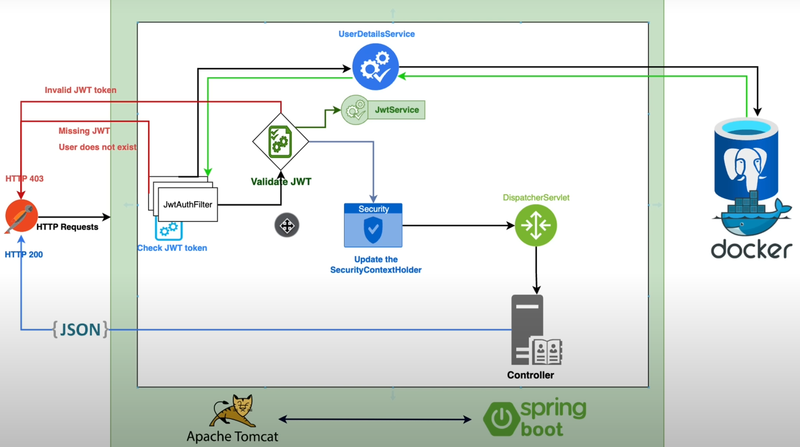

# security-jwt-project
Desenvolvendo endpoints para registro e autenticação de usuário, acompanhando o vídeo do canal [AmigosCode](https://www.youtube.com/@amigoscode) sobre autenticação com Jwt, utilizando Spring Boot 3 e Spring Security 6. 

### Tecnologias utilizadas:

- Java 20
- Spring Boot 3
- Spring Security 6
- Lombok
- Jwt
- PostgreSQL
- BCrypt

##### Link para o vídeo:
- [Spring Boot 3 + Spring Security 6 - JWT Authentication and Authorisation [NEW] [2023]](https://youtu.be/KxqlJblhzfI)
